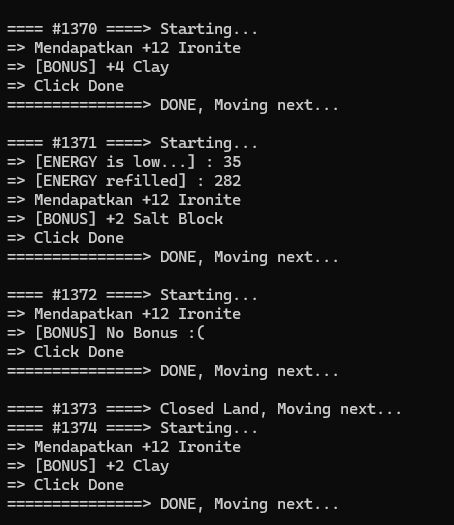

# Pixels.xyz Auto Mining - LAND BASED (Temporary)

Script auto mining pixels berdasarkan land, 1347-1381



## Fitur dan Kekurangan :

- Auto isi Energy
- Auto skip land
- Log hasil mining (di Console)
- Bypass Bot Detection (dengan Puppeteer-Extra-Stealth)
- Tidak bisa buka chrome ketika jalan (Kecuali pakai chromium dan buka chrome)

## Requirements

- Node.js (Latest)
- Puppeteer (Vanilla & Extra-Stealth)
- Chromium (Optional sebagai 2nd Browser)

## How to Run

- Clone / Download File & Extract

- Install node Package : 
```npm install puppeteer-extra puppeteer-extra-plugin-stealth```

- Edit config.json sesuai path file dan save

- Pastikan Character stay di #1347 dan tidak bergerak

- Jalankan run.bat

### Note :
- Jika terjadi error :
Land mengulang-ulang
Wrong Position berkali-kali
- Perhatikan dan catat land terakhir dan gerakkan character ke tempat Teleport Awal land, lalu start lagi.